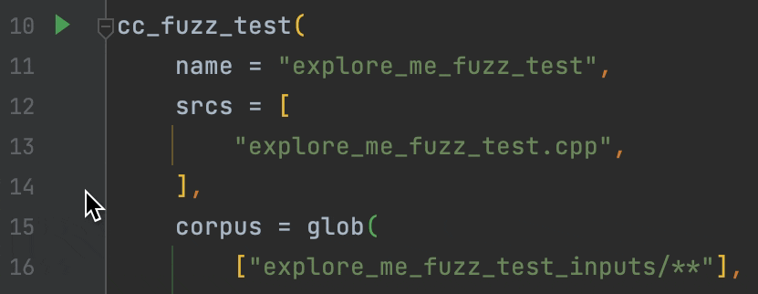

# Coverage IDE integrations

## Jetbrains IDE's

### CMake (in CLion)
You can start coverage runs from within CLion with the help of CMake
user presets. Custom cifuzz presets can be added by running:
    
    cifuzz integrate cmake

Those presets have to be enabled before they show up as a run configuration.
See the [CLion documentation on presets
detection](https://www.jetbrains.com/help/clion/cmake-presets.html#detect) for
more details.


### Bazel (in IntelliJ with Bazel Plugin)

To create a coverage report for your bazel project, these lines of code have
to be added to your `.bazelrc` file.

```
# Coverage with Replay (C/C++ only)
coverage --@rules_fuzzing//fuzzing:cc_engine=@rules_fuzzing//fuzzing/engines:replay
coverage --@rules_fuzzing//fuzzing:cc_engine_instrumentation=none
coverage --@rules_fuzzing//fuzzing:cc_engine_sanitizer=none
coverage --instrument_test_targets
coverage --action_env=BAZEL_USE_LLVM_NATIVE_COVERAGE=1
coverage --action_env=GCOV=llvm-profdata
coverage --action_env=BAZEL_LLVM_COV=llvm-cov
coverage --combined_report=lcov
coverage --experimental_use_llvm_covmap
coverage --experimental_generate_llvm_lcov
```

This allows bazel to run the fuzz tests with coverage. 

You can start a coverage run by opening the bazel BUILD file and executing the 
fuzz test defined with `cc_fuzz_test` with "Run ... with Coverage". 
This will run the fuzz test with the finding inputs from the `*_inputs` directory
and produce a coverage report which can be viewed in your IDE **if the fuzz test
passes**. If the fuzz test fails, the bugs must be fixed before a coverage report 
can be produced.



### Maven/Gradle (in IntelliJ)
You can start a coverage with "Run ... with Coverage". This will run the
fuzz test with the finding inputs from the `*Inputs` directory in
your test resources and produce a coverage report.


## VS Code

### CMake/Maven/Gradle
You can start coverage runs from within VS Code with the help of tasks. See
[How to Integrate with External Tools via
Tasks](https://code.visualstudio.com/docs/editor/tasks) for more details. A
custom cifuzz coverage task can be added by running:

    cifuzz integrate vscode

Coverage reports can be visualized with the
[Coverage Gutters extension](https://marketplace.visualstudio.com/items?itemName=ryanluker.vscode-coverage-gutters).


### Bazel
Right now we do not support starting a coverage run directly from VSCode for Bazel, 
but you can use a created coverage report with the 
[Coverage Gutters extension](https://marketplace.visualstudio.com/items?itemName=ryanluker.vscode-coverage-gutters). 

For this you have to create a coverage report with cifuzz by running:

    cifuzz coverage --format lcov --output lcov.info <target>

The extension will pick up the results in the `lcov.info` file automatically 
and visualize it inside VSCode.
