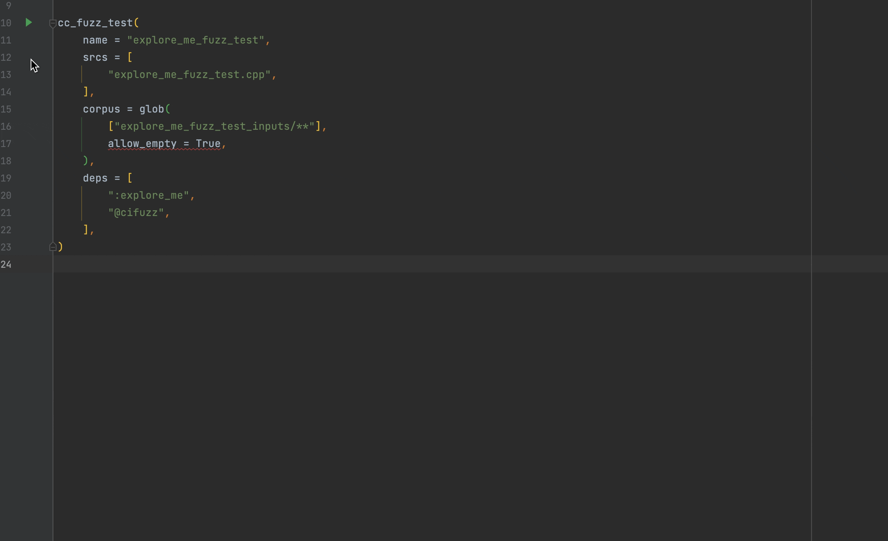

# Regression Testing

In general there are two ways to run your fuzz test:

1. As an **actual fuzzing run**, by calling: `cifuzz run my_fuzz_test_1`.  The
   fuzzer will rapidly generate new inputs and feed them into your fuzz test.
   Any input that covers new parts of the fuzzed project will be added to the
   generated corpus. cifuzz will run until a crash occurs and report detailed
   information about the finding.

2. As a **regression test**, by invoking it through your IDE/editor or by directly
   executing the replayer binary. This will run the fuzz test on all inputs stored 
   in the`<fuzz-test-name>_inputs` next to the fuzz test. 

The regression test mode can be used to test that inputs which previously resulted 
in findings do not result in findings anymore. 

In case a crash was found, a directory will be created and the crashing 
input is added to it automatically. The fuzz test will stop immediately after 
applying all inputs or earlier if a regression occurs.

To work correctly, the fuzz test has to be build with so-called sanitizers, 
which track the execution at runtime to be able to detect various errors.

### CMake

It is recommended to use the provided CMake user presets, which can be
generated with `cifuzz integrate cmake`. Those provide a preset for
regression testing, which can be executed from within your IDE or in
the cli.

After selecting the preset the fuzz test is executed in regression
test mode.


You can also run the fuzz tests in regression test mode from the CLI:

```bash
cmake --preset="cifuzz (Regression Test)"
cmake --build --preset="cifuzz (Regression Test)"
ctest --preset="cifuzz (Regression Test)"
```

You can find the generated binaries in
`.cifuzz-build/replayer/address+undefined/`.

### Bazel

To execute a fuzz test as a regression test the following custom configuration has
to be added to the `.bazelrc` file in the project workspace.

```
# Replay cifuzz findings (C/C++ only)
build:cifuzz-replay --@rules_fuzzing//fuzzing:cc_engine=@rules_fuzzing//fuzzing/engines:replay
build:cifuzz-replay --@rules_fuzzing//fuzzing:cc_engine_instrumentation=none
build:cifuzz-replay --@rules_fuzzing//fuzzing:cc_engine_sanitizer=asan
build:cifuzz-replay --@rules_fuzzing//fuzzing:cc_engine_sanitizer=ubsan
build:cifuzz-replay --compilation_mode=opt
build:cifuzz-replay --copt=-g
build:cifuzz-replay --copt=-U_FORTIFY_SOURCE
build:cifuzz-replay --test_env=UBSAN_OPTIONS=halt_on_error=1
```

This allows the bazel flag `--config=cifuzz-replay` to be added to a fuzz test run via
`bazel test --config=cifuzz-replay`.

In JetBrains IDEs with the [bazel plugin](https://plugins.jetbrains.com/plugin/8609-bazel) 
installed, a fuzz test can be run with this configuration from the `BUILD.bazel` file which 
defines the `cc_fuzz_test` after adding the flag via "Modify Run Configuration".

Running the fuzz test now via "Run '...'" executes it in regression test mode.


